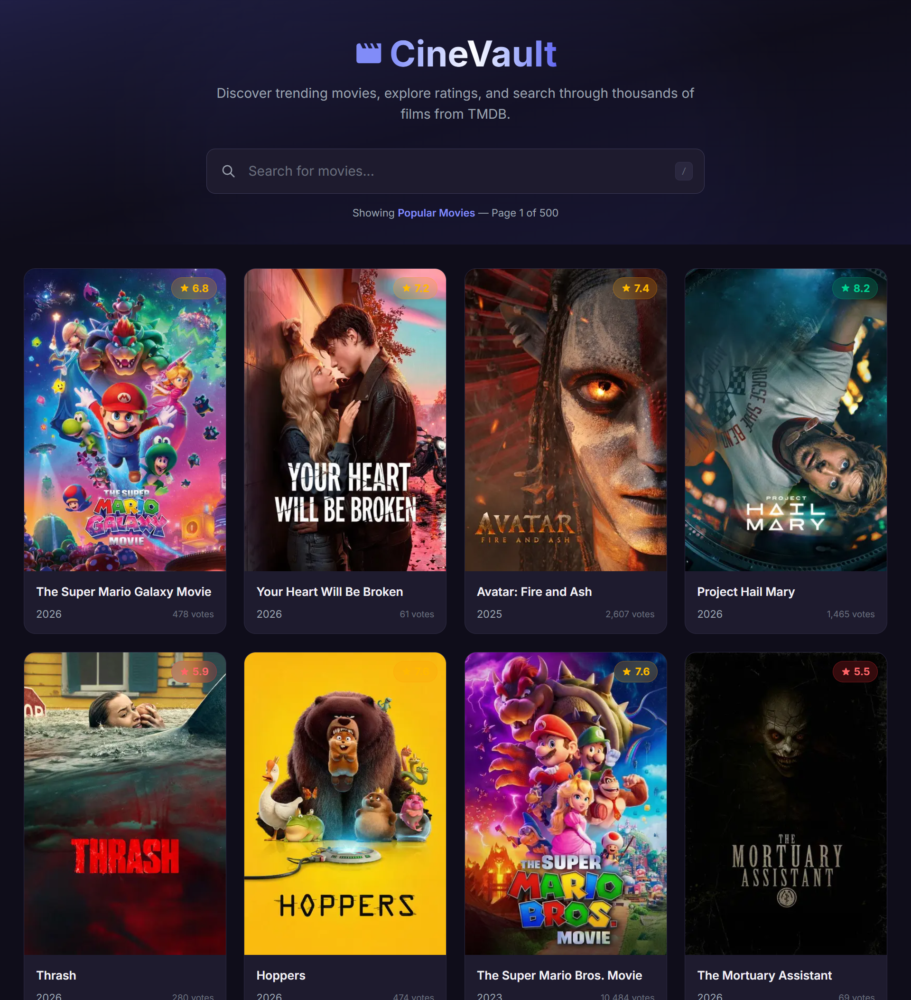

# CineVault — Interactive Movie Explorer

A responsive, single-page movie browsing application built with **Next.js 16**, **JavaScript (ES6+)**, and **Tailwind CSS v4**. It fetches and displays movies from [The Movie Database (TMDB) API](https://www.themoviedb.org/).



---

## Live Demo

🔗 **Deployed App:** [View CineVault Live](https://cinevault-beryl.vercel.app/)

---

## Features

- **Browse Popular Movies** — Displays trending/popular movies from TMDB on initial load.
- **Search Functionality** — Real-time debounced search bar to filter movies by title.
- **Responsive Grid Layout** — Adapts seamlessly across mobile (1 col), tablet (2–3 cols), and desktop (4–5 cols).
- **Movie Cards** — Each card displays the poster, title, release year, rating badge, and vote count.
- **Hover Interactions** — Hovering a movie card reveals the full description overlay with a smooth animation.
- **Loading State** — Skeleton shimmer placeholders that match the card layout for a smooth perceived loading experience.
- **Error Handling** — Friendly error display with a retry button.
- **Pagination** — Navigate through pages of results with smart pagination controls.
- **Keyboard Shortcut** — Press `/` to focus the search bar, `Esc` to clear.
- **Dark Theme** — Premium dark UI with custom color palette, gradients, and micro-animations.

---

## Tech Stack

| Technology   | Version | Purpose                      |
| ------------ | ------- | ---------------------------- |
| Next.js      | 16.2.3  | React framework (App Router) |
| React        | 19.2.4  | UI library                   |
| JavaScript   | ES6+    | Programming language         |
| Tailwind CSS | v4      | Utility-first CSS styling    |
| TMDB API     | v3      | Movie data source            |

---

## Project Structure

```
converslyasstwo/
├── app/
│   ├── globals.css          # Global styles, theme tokens, animations
│   ├── layout.js            # Root layout with metadata & fonts
│   └── page.js              # Home page (renders MovieApp)
├── components/
│   ├── MovieApp.js          # Main client component (state, API, pagination)
│   ├── SearchBar.js         # Search input with keyboard shortcuts
│   ├── MovieGrid.js         # Responsive grid layout
│   ├── MovieCard.js         # Individual movie card with poster & info
│   ├── LoadingSpinner.js    # Skeleton loading placeholders
│   └── ErrorMessage.js      # Error display with retry
├── next.config.mjs          # TMDB image domain configuration
├── package.json
└── README.md
```

---

## Getting Started

### Prerequisites

- **Node.js** ≥ 20.9
- **npm** ≥ 10

### Installation

1. **Clone the repository:**

   ```bash
   git clone <repository-url>
   cd cinevault
   ```

2. **Install dependencies:**

   ```bash
   npm install
   ```

3. **Run the development server:**

   ```bash
   npm run dev
   ```

4. **Open the app:**

   Navigate to [http://localhost:3000](http://localhost:3000) in your browser.

---

## API

This application uses the [TMDB API v3](https://developer.themoviedb.org/docs) with the following endpoints:

| Endpoint               | Purpose                             |
| ---------------------- | ----------------------------------- |
| `GET /3/movie/popular` | Fetch popular movies (default view) |
| `GET /3/search/movie`  | Search movies by title              |

**Image CDN:** Poster images are served from `https://image.tmdb.org/t/p/w500/`.

---

## State Management

State is managed using React's built-in `useState` and `useEffect` hooks within the `MovieApp` component. Key state includes:

- `movies` — Array of movie objects from the API
- `searchQuery` / `debouncedQuery` — Raw and debounced search input
- `loading` / `error` — Loading and error states for API calls
- `page` / `totalPages` — Pagination tracking

Search input is debounced (400ms) to minimize unnecessary API calls.

---

## Component Architecture

```
RootLayout
└── MovieApp (client component — state management)
    ├── SearchBar (search input, keyboard shortcuts)
    ├── LoadingSpinner (skeleton placeholders)
    ├── ErrorMessage (error display + retry)
    ├── MovieGrid (responsive grid container)
    │   └── MovieCard[] (individual movie cards)
    └── Pagination (page navigation controls)
```

---

## Responsive Breakpoints

| Breakpoint  | Columns | Target Device |
| ----------- | ------- | ------------- |
| < 640px     | 1       | Mobile        |
| 640–767px   | 2       | Large mobile  |
| 768–1023px  | 3       | Tablet        |
| 1024–1279px | 4       | Small desktop |
| ≥ 1280px    | 5       | Large desktop |

---

## Architectural Decisions

1. **Client Component for MovieApp** — Since search, pagination, and API fetching require client-side interactivity, the main `MovieApp` is a client component. The `page.js` remains a server component wrapper.
2. **Debounced Search** — 400ms debounce prevents excessive API calls while typing.
3. **Next.js Image Component** — Used for automatic image optimization with TMDB poster images.
4. **Skeleton Loading** — Shimmer placeholders match card dimensions for smooth perceived performance instead of a generic spinner.
5. **Inline SVG Icons** — No external icon libraries needed, keeping the bundle lightweight.

---
